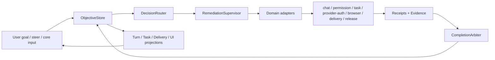

# Objective Recovery Control Plane：架构设计

## 目标与约束

- 首期继续使用 Tauri、Rust、React 和 SQLite，不引入远端控制平面。
- `objective` 是业务状态真相源；chat turn、task、tool、browser lease、DeliveryRun 与 workflow 只是 projections/adapters。
- 恢复允许 at-least-once observe，任何外部 mutation 必须由 idempotency/receipt fence 收敛为 effectively-once。
- 匿名会话不持久化，不承诺跨进程恢复；显式 cancel/deny 和 destructive hard deny 保持现有安全语义。
- 旧 DB additive migration；身份不足的旧行 fail closed 为 `legacy_orphan`。

## 高层组件



## 数据模型

### `objectives`

| 字段 | 语义 |
| --- | --- |
| `id`, `revision`, `kind` | 稳定目标身份与单调 revision |
| `session_id`, `root_turn_id`, `task_id`, `delivery_run_id` | 现有对象投影引用；均可空但 identity chain 必须唯一 |
| `status`, `decision_type`, `domain` | typed state；system-owned 不得 terminal blocked |
| `autonomous_completion`, `requested_acceptance`, `reached_acceptance` | 授权与不可降低的完成边界 |
| `output_started`, `side_effect_started` | provider/tool replay latch |
| `failure_code`, `failure_signature`, `remediation_id` | 稳定失败与恢复归属 |
| `resume_cursor`, `evidence_ref`, `last_progress_at` | 安全续接、完成证据和真实进展 |
| `next_attempt_at`, `lease_owner`, `lease_expires_at` | durable scheduling/CAS claim |
| `requires_user_action`, `request_key`, `decision_key` | 仅 core input/business decision 使用 |
| `created_*`, `last_observed_*`, timestamps | immutable provenance 与观察 provenance |

数据库约束：

- `completed` 必须有 `decision_type=complete`、`evidence_ref`、`completed_at`，且无 lease/remediation；
- `cancelled` 只允许显式 cancel/deny provenance；
- `requires_user_action=1` 只允许 `core_input_required/needs_business_decision`；
- system-owned decision 不允许 `status IN ('blocked','completed','cancelled')`；
- 同一 identity-complete active objective 唯一；requested acceptance 不可降低。

### `objective_bindings`

把 objective 绑定到 root turn、task、tool call、browser/terminal lease、DeliveryRun、release batch；保存 domain、resource generation、identity digest、resume cursor 与 output/side-effect latch。同一 active resource generation 只能属于一个 objective。

### `objective_events` 与 `objective_evidence`

append-only typed event 与证据引用。event 记录 state/decision/progress/owner 变化但不保存 raw prompt/tool args；evidence 保存 kind、digest、scope、freshness 与可重新读取的 ref，供 CompletionArbiter 按 objective kind 校验。

### `objective_decisions`

append-only decision journal：revision、domain、decision envelope JSON、failure signature、owner、output/side-effect latch、evidence ref、创建 provenance。用于审计非法状态和计算指标。

### `objective_remediations`

durable queue：`queued/claimed/observing/repairing/verifying/waiting/completed`、adapter、attempt/approach、resume cursor、next attempt、lease、last progress、failure code。恢复耗尽只切 approach 或进入 system incident，不把 objective 交给用户；incident 必须停止同策略 claim，等待恢复策略或能力 revision 变化。

完成或 system incident 的收敛由 ObjectiveStore 在一个 SQLite 事务内写入同一 `terminal_revision`：Objective decision、精确 `visible_final_message_id/kind`、turn settlement、stream closure、run-control 与暂态 tool projection不可拆分提交。AgentLoop 返回实际持久化的 `final_message_id`，Completion Arbiter 不得依靠消息 row order 猜测终答。

### `side_effect_receipts`

保存 action fingerprint、resource generation、idempotency key、`not_started/started/committed/unknown/reconciled`、外部 identity digest 与安全摘要。同一 objective/revision/action fingerprint 的 committed mutation 唯一；`unknown` 必须先只读 reconcile。

### 现有表

- `chat_turn_state` 增加 `objective_id/turn_settled_at/stream_closed_at`，只做 UI projection；
- `task_runs` 增加 `objective_id/recovery_state/next_attempt_at`；
- `tool_calls` 增加或复用 status/receipt，permission wait 关联 objective；
- `delivery_runs.objective_id` 保留，Completion 写入改由 arbiter；
- `browser_sessions` 的 lease owner 关联 objective；
- `objective_recovery_attempts` 继续作为兼容 journal，逐步由统一 decisions/remediations 替代。

## API 与类型合同

```rust
enum DecisionType {
    Continue, Waiting, ApplyRecommended, PlatformIncident, FailedInternal,
    CoreInputRequired, AuthorizationRequired, NeedsBusinessDecision, Complete, Cancelled,
}

struct DecisionEnvelope {
    objective_id: String,
    revision: i64,
    domain: RecoveryDomain,
    decision_type: DecisionType,
    failure_code: Option<String>,
    failure_signature: Option<String>,
    recovery_owner: Option<String>,
    remediation_id: Option<String>,
    next_attempt_at: Option<i64>,
    next_action_authorized: bool,
    requires_user_action: bool,
    output_started: bool,
    side_effect_started: bool,
    resume_cursor: Option<String>,
    requested_acceptance: String,
    reached_acceptance: String,
    evidence_ref: Option<String>,
}
```

核心服务：

- `ObjectiveStore::ensure/observe/apply_decision/claim/heartbeat/progress`；
- `DecisionRouter::route(signal, objective)`，所有 adapter 共用；
- `CompletionArbiter::decide(objective, evidence)`，唯一 Complete 入口；
- `RemediationSupervisor::poll_once`，startup 和 15 秒常驻循环共用；
- `ObjectiveDomainAdapter::observe/reconcile/plan_safe_action/execute_with_fence/completion_evidence`。

前端只接收 `ObjectiveSnapshot`，不从 tool/task error string 推断 owner 或 CTA。

## Supervisor 算法

```text
scan due objective/remediation
  -> CAS claim expired/unowned lease
  -> adapter.observe()                 # always read-only first
  -> reconcile receipts/side effects
  -> DecisionRouter.route(signal)
  -> if continue/apply_recommended: adapter.repair_or_resume()
  -> if waiting/incident: persist next_attempt + owner, release lease
  -> if core input/business decision: persist one request, retain objective
  -> if candidate complete: CompletionArbiter verifies fresh evidence
  -> append decision/progress event, update projections
```

同一 failure signature 连续失败时增加 `approach_index`，不生成用户 CTA。heartbeat 只延长 owner liveness；只有 receipt、head、verification 或 state transition 更新 `last_progress_at`。

## Domain Adapters

| Adapter | Observe/reconcile | Safe resume | 不可盲重放边界 |
| --- | --- | --- | --- |
| Chat / Context | root turn、history、turn/tool state、route attempts、budget snapshot | 重建 frozen contract/route plan，从 checkpoint 开新内部 segment | 已有可见输出或未结算 tool intent |
| Tool / Terminal | invocation、process generation、exit/outcome receipt | timeout/panic 后先 attach/observe，再从 cursor 继续 | 非幂等命令结果未知 |
| Permission | action signature、prompt outcome、policy | timed out/channel closed 重建 wait；Allow 后继续原 cursor | explicit deny、hard deny |
| Task | task/attempt/journal/worktree/verification | durable backoff、换 approach/route、同 session 重派 | merge-back receipt 未知 |
| Provider/Auth | route health、output/side-effect latch、credential broker | 零输出切 route；auth 输入满足后 resume | partial output/tool activity |
| Browser | managed/Chrome lease、pairing、page/submit receipt | 公开页切 managed；配对/2FA 后 attach | submit/pay/delete/publish receipt 未知 |
| Delivery | repo/worktree/head/canonical PR/release receipt | 同 PR 修复、CI/merge/release 对账 | external mutation result unknown |
| Release | version batch、PR head、checks、merge policy、tag/artifact | auto/queue merge、重跑同 batch、artifact verify | tag/release create result unknown |
| Update | 全域 active owner、download/install state | 等待安全点、安装、启动后 claim | 任一 owner 或外部 mutation 状态未知 |

## Chat Resume

`AgentLoop` 返回 typed `RunOutcome`，desktop 不再丢弃 `StopReason`：

- `Finished` 仅提交 candidate evidence 给 arbiter；
- `Incomplete/FailedInternal/PlatformIncident/IterationCeiling/BudgetExhausted` 结算当前 turn segment，但 objective 进入 durable remediation；
- `Cancelled` 由显式用户 cancel 终止；
- permission timeout/channel close 产生 `waiting_system`，不进入 blocker summary。

supervisor 重建 session settings、frozen capability、route plan 与 agent history，使用原 root turn/objective，不插入新的 user message。若 pending tool 副作用未知，先由 tool/domain adapter 补 receipt 或只读对账，再允许新的模型 segment。

## UI Projection

`ObjectiveSnapshot` 投影到现有 `TurnActivitySnapshot` 与 Task/Delivery 视图：

- stream 关闭不隐藏 `active/waiting_system/recovering` objective card；
- system-owned card 展示 owner、阶段、最近 progress、next observation，无 CTA；
- core input/business decision 卡各自只有一次结构化 CTA；
- completed 只来自 arbiter evidence，delivery ladder继续区分 PR/CI/merge/release/live。

## Metrics

从 objective/decision/remediation journal 聚合：reprompt driver、system-owned user handoff、recovery success/latency、ownerless duration、duplicate receipt、false complete、ceiling downgrade、core input request count、business decision precision。查询只输出聚合，不输出 chat body、tool args、secret 或真实 ID。

## 兼容、发布与回滚

- migration 先建新表/nullable refs，再双写 projection；旧 reader 不依赖新表。
- migration 与 `ObjectiveStore::ensure_schema` 同时实现且幂等，覆盖历史 migration checksum/version 冲突的启动路径。
- identity 不足旧行标 `legacy_orphan`；不自动执行。
- 首个 release 保留旧字段读取，UI 优先 typed snapshot；回滚版本忽略 additive tables。
- release gate 要求 migration fixture、fault injection receipts、CodeFactoryDev、PR/CI、正式 artifact/install 和 24h KPI。
- 回滚只回应用版本，不删除新表；新版本再次安装可继续未完成 objective。

## 权衡

- 选择本地 durable queue 而不是远端 orchestrator：降低部署和隐私成本，但 App 完全离线时只能在下次启动恢复。
- 选择 at-least-once observe + receipt fence：比全局 exactly-once 更可落地，但每个外部 adapter 必须实现幂等/对账合同。
- 保留 bounded fast retry，耗尽转 durable queue：避免同步无限占用模型和 UI，同时不把预算当用户门禁。
- 先统一状态与 adapter 合同，再逐步增强自动修复能力；任何未实现 adapter 仍需 system-owned incident owner，不能回退人工“继续”。
